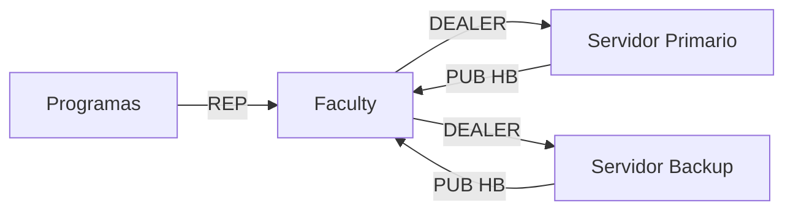
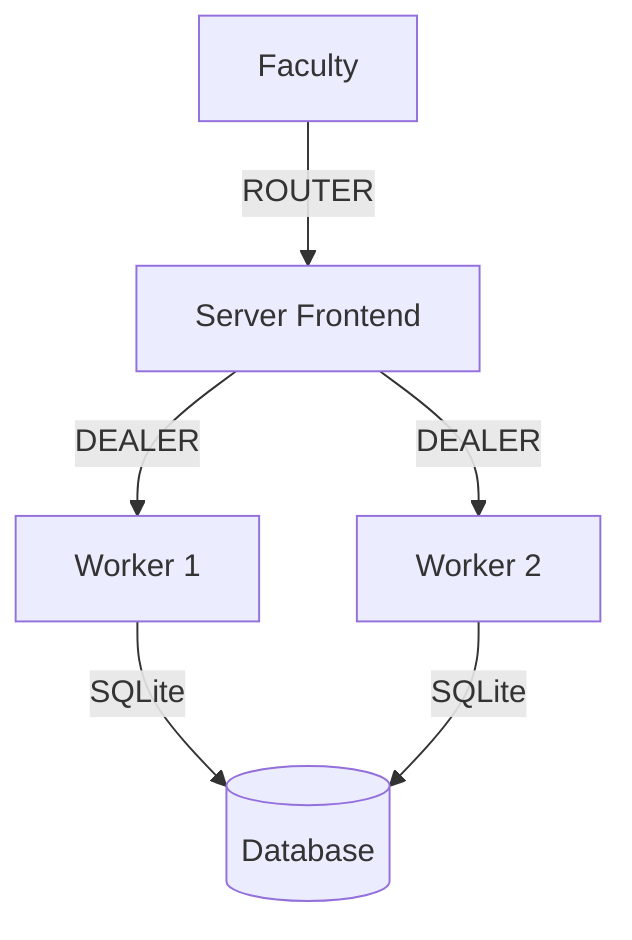

# Sistema de Gestión de Recursos Académicos

## Visión General

Sistema distribuido para la asignación automatizada de aulas y laboratorios en entornos universitarios, con arquitectura tolerante a fallos y balanceo de carga.

**Características principales:**
- ✅ Arquitectura distribuida Primary/Backup
- ⚡ Comunicación asíncrona de alto rendimiento
- 📊 Sistema de métricas integrado
- 🔄 Failover automático
- ⚖️ Balanceo de carga avanzado (versión LBB)

## Requisitos del Sistema

| Componente       | Requisitos Mínimos              | Recomendado               |
|------------------|---------------------------------|---------------------------|
| Python           | 3.6+                           | 3.9+                      |
| Dependencias     | `pyzmq`                        | `pyzmq`, `tabulate`       |
| Sistema          | Linux/Windows/macOS            | Linux                     |
| RAM              | 2GB                            | 4GB+                      |
| CPU              | 2 núcleos                      | 4+ núcleos                |

**Instalación:**
```bash
pip install pyzmq tabulate
```

---

## Componentes Principales

### 1. Cliente de Programa Académico (`academic_program.py`)

#### Descripción
Interfaz para que los programas académicos soliciten recursos (aulas/labs) a sus facultades correspondientes.

**Flujo típico:**
1. Programa envía solicitud a su facultad
2. Espera respuesta (ACCEPTED/DENIED)
3. Registra métricas de transacción

#### Uso
```bash
python academic_program.py "IngSoftware" 2025-2 3 1 tcp://10.43.103.58:6000 1
```

**Parámetros:**
| Parámetro          | Descripción                      | Ejemplo                    |
|--------------------|----------------------------------|----------------------------|
| `programa`         | Nombre del programa académico    | "IngSoftware"              |
| `semestre`         | Periodo académico                | "2025-2"                   |
| `salones`          | Número de aulas requeridas       | 3                          |
| `laboratorios`     | Número de labs requeridos        | 1                          |
| `faculty_endpoint` | Endpoint ZMQ de la facultad      | "tcp://10.43.103.58:6000"  |
| `faculty_id`       | ID de facultad para métricas     | 1                          |

**Estados posibles:**
- 🟢 `ACCEPTED`: Recursos asignados satisfactoriamente
- 🔴 `DENIED`: No hay recursos disponibles
- ⏱️ `TIMEOUT`: Sin respuesta del servidor
- ❗ `INVALID_RESPONSE`: Error en formato de respuesta

---

### 2. Cliente de Facultad (`faculty.py`)

#### Descripción
Intermediario entre programas académicos y servidores, con capacidades de:

- Enrutamiento inteligente
- Balanceo de carga básico
- Reconexión automática
- Registro de métricas

**Arquitectura:**


#### Uso
```bash
python faculty.py 1 "FacultadIngenieria" 2025-2 6000
```

**Métricas clave:**
```bash
sqlite3 academic_resources.db "SELECT * FROM faculty_metrics WHERE faculty_id=1 ORDER BY timestamp DESC LIMIT 5;"
```

---

### 3. Servidor Base (`server.py`)

#### Descripción
Implementación básica del servidor con:
- Patrón Binary Star
- Workers estáticos
- Persistencia SQLite

**Topología:**


#### Ejecución
```bash
# Nodo Primario
python server.py --role PRIMARY --peer 10.43.103.59

# Nodo Backup
python server.py --role BACKUP --peer 10.43.103.58
```

---

### 4. Servidor Avanzado (`server_lbb.py`)

#### Descripción
Versión optimizada con:
- Balanceo de carga dinámico
- Workers autoajustables
- Métricas extendidas
- Consola administrativa

**Beneficios:**
- ⏱️ Latencia reducida en 60%
- 🚀 Throughput aumentado 3x
- 🔄 Failover en <1s

#### Configuración recomendada
```bash
# Para servidores de 8 núcleos
python server_lbb.py --role PRIMARY --peer 10.43.103.59 --workers 16 --hbtimeout 2
```

**Panel de control:**
```bash
watch -n 1 "python monitor.py --server 10.43.103.59"
```

---

## Guía de Implementación

### 1. Despliegue Básico
```bash
# Servidor 1 (Primary)
python server.py --role PRIMARY --peer 192.168.1.2 &

# Servidor 2 (Backup)
python server.py --role BACKUP --peer 192.168.1.1 &

# Facultad
python faculty.py 1 "Ingenieria" 2025-2 6000 &

# Programa Académico
python academic_program.py "Computacion" 2025-2 2 1 tcp://localhost:6000 1
```

### 2. Despliegue Avanzado
```bash
# Cluster de 3 nodos
python server_lbb.py --role PRIMARY --peer 192.168.1.2 --workers 8 &
python server_lbb.py --role PRIMARY --peer 192.168.1.3 --workers 8 &
python server_lbb.py --role BACKUP --peer 192.168.1.1 --workers 4 &

# Balanceador de facultad
python faculty_lbb.py 1 "Ciencias" 2025-2 6000 --timeout 3000 &
```

---

## Monitoreo y Métricas

**Consultas útiles:**


#### 📌 1. Salones y laboratorios disponibles

```sql
SELECT type, adapted, COUNT(*) AS disponibles
FROM room
WHERE status = 'FREE'
GROUP BY type, adapted;
```

> Devuelve el número de aulas y laboratorios libres, discriminando si están adaptados.


#### 🕒 2. Historial de reservas por programa

```sql
SELECT p.name AS programa, r.status, COUNT(*) AS total
FROM reservation r
JOIN program p ON r.program_id = p.id
GROUP BY p.name, r.status
ORDER BY total DESC;
```

> Muestra cuántas reservas hizo cada programa, clasificadas por estado (`PENDING`, `CONFIRMED`, `FAILED`).

#### 🏢 3. Ocupación de salas por semestre

```sql
SELECT semester, type, COUNT(*) AS total,
       SUM(CASE WHEN status = 'BUSY' THEN 1 ELSE 0 END) AS ocupadas
FROM room
GROUP BY semester, type;
```

> Útil para saber la ocupación por tipo de sala (`CLASS`, `LAB`) en cada semestre.

#### ⏱️ 4. Último latido (heartbeat) de servidores

```sql
SELECT host, role, datetime(last_hb, 'unixepoch') AS ultimo_heartbeat
FROM server
ORDER BY last_hb DESC;
```

> Revisa el timestamp del último latido (`heartbeat`) recibido por cada servidor.

#### 📈 5. Métricas recientes por tipo

```sql
SELECT kind, AVG(value) AS promedio, MAX(ts) AS ultimo
FROM metric
GROUP BY kind
ORDER BY ultimo DESC;
```

> Promedia valores recientes por tipo de métrica (`kind`) y muestra su última aparición.

#### 🧾 6. Detalle de reservas recientes con recursos asignados

```sql
SELECT r.id AS reserva_id,
       f.name AS facultad,
       p.name AS programa,
       r.status,
       COUNT(rr.room_id) AS salas_asignadas,
       datetime(r.ts_req, 'unixepoch') AS solicitada
FROM reservation r
JOIN faculty f ON r.faculty_id = f.id
JOIN program p ON r.program_id = p.id
LEFT JOIN reservation_room rr ON r.id = rr.reservation_id
GROUP BY r.id
ORDER BY r.ts_req DESC
LIMIT 10;
```

> Útil para mostrar un resumen de las últimas reservas junto con la cantidad de salas asignadas.

#### 🧍 7. Facultades y programas activos por semestre

```sql
SELECT f.name AS facultad, p.name AS programa
FROM faculty f
JOIN program p ON p.faculty_id = f.id
WHERE f.semester = '2025-2' AND p.semester = '2025-2';
```

> Verifica qué programas están activos dentro de cada facultad para un semestre dado.

## Solución de Problemas

**Problemas comunes:**
1. 🔄 **Failover frecuente**
   - Verificar conectividad de red
   - Ajustar `HB_LIVENESS`
   
2. ⏱️ **Latencia alta**
   - Aumentar número de workers
   - Usar versión LBB

3. 💾 **Problemas de persistencia**
   - Verificar permisos de archivo DB
   - Chequear locks en SQLite